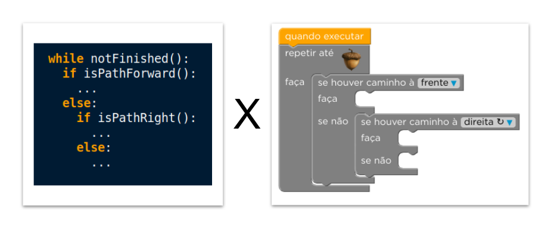

<!--
author:   Andrea Charão

email:    andrea@inf.ufsm.br

version:  0.0.1

language: PT-BR

narrator: Brazilian Portuguese Female

comment:  Material de apoio para a disciplina
          ELC106 - Algoritmo e Programação,
          da Universidade Federal de Santa Maria

script:   https://d3js.org/d3.v7.min.js

translation: English  translations/English.md
-->

<!--
liascript-devserver --input README.md --port 3001 --live
-->

# Aula 01: Do hardware ao software

> Nesta aula, vamos **revisar e interligar** alguns conceitos importantes na área desta disciplina.

<iframe width="100%" height="684" frameborder="0"
  src="https://observablehq.com/embed/@andreainfufsm/hardware-software-loop?cells=chart"></iframe>

## Como computadores funcionam?

Este vídeo resume o funcionamento de computadores desde o surgimento até os dias atuais:

<iframe width="560" height="315" src="https://www.youtube.com/embed/mCq8-xTH7jA?hl=pt-br&cc_lang_pref=pt&cc_load_policy=1" title="How computers work?" frameborder="0" allow="accelerometer; autoplay; clipboard-write; encrypted-media; gyroscope; picture-in-picture; web-share" allowfullscreen></iframe>

Link: https://www.youtube.com/watch?v=mCq8-xTH7jA

### Você responde!

O que será que você entendeu do vídeo? E o que será que você já sabe sobre este assunto?

Responda rápido as **4 questões** a seguir (clique em  ->  abaixo para avançar!).

        {{1}}                            
<section>                          
Segundo o vídeo, quais são as 4 tarefas básicas, comuns a todos os computadores?

- [( )] Jogos, realidade virtual, design e música
- [(x)] Entrada, armazenamento, processamento, saída
- [( )] Adição, subtração, multiplicação, divisão

</section>

        {{2}}
<section>                            
Marque as tarefas associadas a cada parte/acessório do computador:

- [[entrada] [armazenamento] [processamento] [saída]]
- [      [ ]             [ ]             [ ]     [x]  ]  Monitor Full HD
- [      [x]             [ ]             [ ]     [ ]  ]  Leitor de impressão digital
- [      [x]             [ ]             [ ]     [x]  ]  Headset com microfone e fone de ouvido
- [      [ ]             [ ]             [x]     [ ]  ]  Intel® Core™ i7-1165G7
- [      [x]             [ ]             [ ]     [x]  ]  Tela sensível ao toque (touchscreen)
</section>

        {{3}}
<section>                            
Mais uma vez! Marque as tarefas associadas a cada parte/acessório do computador:

- [[entrada] [armazenamento] [processamento] [saída]]
- [      [x]             [ ]             [ ]     [ ]  ]  Scanner
- [      [ ]             [x]             [ ]     [ ]  ]  Memória de 6GB
- [      [ ]             [ ]             [ ]     [x]  ]  Impressora laser
- [      [ ]             [x]             [ ]     [ ]  ]  SSD de 512GB
- [      [x]             [ ]             [ ]     [ ]  ]  Teclado ABNT2
</section>

        {{4}}
<section>   
Vamos às compras? :-)  Nesses aparelhos tão diferentes, quais opções abaixo representam características em comum?

- [[ ]] Todos possuem um processador Intel
- [[x]] Todos executam tarefas de entrada, armazenamento, processamento e saída
- [[ ]] Todos vêm com sistema operacional Windows instalado
- [[x]] Todos têm capacidade de armazenar um arquivo com 1 GB de dados

   

Ficou em dúvida? Confira as especificações aqui:

https://www.dell.com/pt-br/shop/notebooks/notebook-inspiron-15-3000/spd/inspiron-15-3511-laptop

https://www.samsung.com/br/watches/galaxy-watch/galaxy-watch5-40mm-silver-bluetooth-sm-r900nzspzto/#specs

https://www.apple.com/br/iphone-14-pro/specs/

</section>

### Hardware x Software

> Você sabe a diferença entre hardware e software?

  {{1}}
<section> 

:-) 

Link: https://www.pensador.com/frase/MzA1NTU2Nw/ 
</section>

### Software, programa, algoritmo e afins

> Saiba diferenciar estes conceitos!

Alguns conceitos importantes que estão muito interligados:

- **software** = um conjunto de programas "usáveis" (mais do que programas, são produtos destinados a usuários e estão sujeitos a critérios de qualidade). Exemplos: Chrome, Instagram, Android, etc.

- **programa** = um conjunto de instruções em uma linguagem de programação que codificam um algoritmo para um computador executá-lo. Exemplos: um programa em Python para obter e analisar dados de compras do governo federal, uma função em R para calcular o fatorial de um número

- **linguagem de programação** = um conjunto de símbolos e regras gramaticais criado para controlar o comportamento de um computador (ou ainda, para expressar algoritmos de forma executável pelo computador). Exemplos: Python, R, Java, etc.

- **algoritmo** = lógica passo-a-passo para realizar uma tarefa (com ou sem computadores). Exemplos: algoritmo para fazer um sanduíche, para calcular a raiz quadrada de um número, etc.

- **software básico**: software essencial para que o computador e programas funcionem. Exemplos: sistema operacional Windows, interpretador Python, etc.

- **pensamento computacional** = habilidades inspiradas em computação para resolver problemas de forma eficiente. Exemplos: decomposição, identificação de padrões, abstração, algoritmo

## Iniciando em programação 

Em breve você estará assim! :-)

<iframe src="https://giphy.com/embed/scZPhLqaVOM1qG4lT9" width="480" height="480" frameBorder="0" class="giphy-embed" allowFullScreen></iframe>
<a href="https://giphy.com/gifs/scaler-official-monday-computer-laptop-scZPhLqaVOM1qG4lT9">via GIPHY</a>

### Funcionamento do computador influencia linguagens

Linguagens de programação têm muitas instruções para lidar com **entrada, armazenamento, processamento, saída**

Veja o que fazem estes códigos escritos em Python:

- `x = input()`: aguarda digitação de dado e o armazena na variável `x` (entrada/armazenamento)

- `print(int(x)+5)`: calcula soma e mostra resultado na tela (processamento/saída) 

- `turtle.forward(50)`: recalcula posição de objeto (turtle) e atualiza sua imagem na tela (processamento/armazenamento/saída) 

> Resumindo: **Comandos se agrupam em categorias!**
> É bom lembrar disso quando você estiver aprendendo novos comandos e novas linguagens.

### Linguagens textuais x visuais

Maioria das linguagens de programação usadas profissionalmente são **textuais**, mas também existem linguagens **visuais**

| Linguagens textuais   | Linguagens visuais   |
| :--------- | :--------- |
| Instruções usam  símbolos textuais, pontuação e regras gramaticais    | Instruções usam  símbolos  visuais |
| Instruções precisam ser conhecidas e digitadas corretamente, senão o programa não funciona    | Instruções ficam num catálogo acessível via busca/arrastar/soltar/clicar |
| Forma mais poderosa de programação, usada em software profissional | Facilita aprendizado rápido, sem erros de digitação e "encaixes" inválidos |
| Exemplos: Python, R, JavaScript, Java, C/C++, Julia, Scala, etc. | Exemplos Scratch, App Inventor, KNIME, Orange, etc. |

### Programe encaixando blocos

> Experimente um jogo de programação com linguagem visual!

    {{1}}
<section>
Sobre o jogo:

- O objetivo é programar um personagem para fazê-lo chegar até uma posição no labirinto.

- Os comandos da linguagem visual se parecem com peças de quebra-cabeça que se encaixam.

- O jogo tem 20 níveis em dificuldade crescente.

- Os comandos são explicados em vídeo conforme você avança.
</section>

    {{2}}
<section>    
Acesso (LEIA ANTES DE CLICAR!):

1. Você vai precisar se registrar com email e senha. **Guarde a senha!** 

2. Depois de se registrar, você vai clicar em "Tente agora" para jogar.

3. Caso as instruções e legendas não apareçam em português na página e/ou nos vídeos, selecione a língua manualmente (peça ajuda se não localizar onde selecionar).

4. Você leu as 3 instruções anteriores? Então agora acesse a atividade: https://studio.code.org/join/TSRLYL?lang=pt-BR
</section>

## Resumindo

- [ ] Para programar, convém saber que computadores realizam entrada/saída/armazenamento/processamento.

- [ ] Algoritmo, programa e software são conceitos diferentes.

- [ ] Linguagens de programação textual são mais usadas profissionalmente.

- [ ] Também existem linguagens visuais que podem ajudar no aprendizado.

