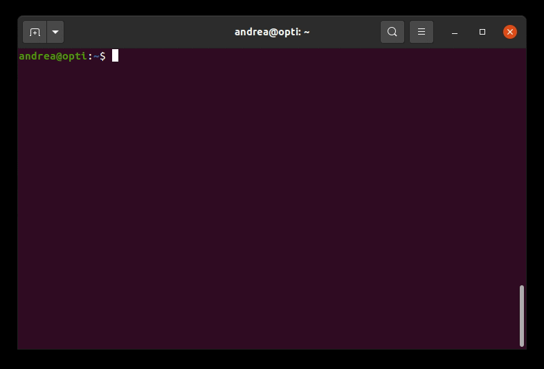

<!--
author:   Andrea Charão

email:    andrea@inf.ufsm.br

version:  0.0.1

language: PT-BR

narrator: Brazilian Portuguese Female

comment:  Material de apoio para a disciplina
          ELC106 - Algoritmo e Programação,
          da Universidade Federal de Santa Maria

translation: English  translations/English.md
-->

<!--
liascript-devserver --input README.md --port 3001 --live
-->

[](https://liascript.github.io/course/?https://raw.githubusercontent.com/AndreaInfUFSM/elc106-2024a/master/classes/02/README.md)

# Aula 02: Primeiro contato com Python

Apertem os cintos, vamos decolar com Python: https://www.python.org/

<div style="width:100%;height:0;padding-bottom:52%;position:relative;"><iframe src="https://giphy.com/embed/coxQHKASG60HrHtvkt" width="100%" height="100%" style="position:absolute" frameBorder="0" class="giphy-embed" allowFullScreen></iframe></div><p><a href="https://giphy.com/gifs/coxQHKASG60HrHtvkt">via GIPHY</a></p>

## Ambiente de trabalho


Aprender e trabalhar com programação requer algumas ferramentas

--{{0}}--
O ambiente de trabalho não é necessariamente um local como este da foto, mas apenas de um computador (ou até um smartphone) com software básico para programação.


### Interpretador Python

--{{0}}--
<section>
Para trabalhar com Python, precisamos de um software básico que entenda "faça o computador entender" esta linguagem.
</section>

--{{0}}--
Um **interpretador** Python é o software que recebe o código de um programa como entrada e faz com que o computador o execute. 

--{{0}}--
A **compilação** é uma etapa de **tradução** de código: um simples comando ou linha se traduz em várias instruções em um código que não precisamos enxergar, pois se destina a ser mais "compreensível" pelo computador. 

--{{0}}--
O **interpretador** recebe este código intermediário e gerencia sua execução. Ou seja, o interpretador Python executa junto com o programa em Python. 

--{{0}}--
**Saiba mais**: capítulo 3.3 do livro "Simplificando Algoritmos", de Andrés Menéndez (https://integrada.minhabiblioteca.com.br/reader/books/9788521638339).


- Software básico, obrigatório
- Recebe o código de um programa como entrada
- Faz com que o computador execute o código



### Integrated Development Environment

              --{{0}}--
<section>
Outra ferramenta importante no seu ambiente de trabaho é o que chamamos de IDE, do inglês *Integrated Development Environment*. Um IDE integra 2 recursos essenciais para produtividade na programação: (1) uma área de edição de programas e (2) uma área de execução que aciona o compilador-interpretador. Outros recursos mais avançados também estão disponíveis, mas não nos interessam agora.

Exemplos de IDEs para Python são IDLE (muito simples, instalado junto com o interpretador), PyCharm (ambiente profissional, com muitos recursos), Spyder, VS Code, entre outros.
</section>

Ambiente integrado de desenvolvimento (IDE - *Integrated Development Environment*)

- Editor: recursos de correção ortográfica, highlight de sintaxe, etc.
- Console de execução do compilador-interpretador
- Outros recursos avançados: depuração/tracing (execução passo-a-passo), controle de versão, etc.
- Exemplos: IDLE, PyCharm, Spyder, VS Code


### IDEs online

              --{{0}}--
<section>
Uma tendência moderna são IDEs online, acessíveis pela internet usando apenas o navegador. A grande vantagem é que não precisamos instalar nada, mas dependemos da rede funcionando.

Há vários IDEs online disponíveis gratuitamente. Um bom IDE online é o Repl.it, que tem bons recursos tanto para iniciantes como para quem quiser se aprofundar.
</section>

IDEs online: Repl.it, Trinket, etc.


              --{{1}}--
<section>
 Um bom IDE online é o Repl.it, que tem bons recursos tanto para iniciantes como para quem quiser se aprofundar.
</section>

    {{1}}
<section> 
Repl.it


- Usuário **visitante** (sem criação de conta) tem acesso à execução de programas.
- Usuário **autenticado** (cria conta com Sign Up e faz Log In) tem acesso ao ambiente com mais recursos.
- Ambiente muito semelhante ao dos IDEs instaláveis localmente.
- Bom para iniciantes e também para quem quer se aprofundar.

</section> 

              --{{2}}--
<section>
 Outro IDE online bem simples é o Trinket. Vamos usá-lo nos primeiros exemplos porque conseguimos embutir este IDE dentro deste material didático, com rápida inicialização do ambiente (ao contrário do Repl.it, que leva mais tempo para iniciar).
</section>

    {{2}}
<section> 
Trinket


- Usuário **visitante** (sem criação de conta) tem acesso a execução e edição de programas, mas não consegue salvá-los.
- Usuário **autenticado** (cria conta com Sign Up e faz Log In) tem acesso a mais opções.
- Ambiente simples, voltado para iniciantes.

</section> 


    {{3}}
<section> 
Outros

- PythonAnywhere (https://www.pythonanywhere.com/): ambiente gratuito simples, mas com planos pagos para uso profissional
- Python Tutor (https://pythontutor.com): voltado para iniciantes, com visualização passo-a-passo da execução
- Online Python (https://www.online-python.com/): semelhante ao Trinket
- Programiz (https://www.programiz.com/python-programming/online-compiler/): ambiente simples, acompanha curso online de Python
- Jupyter Notebooks e Google Colab (https://colab.research.google.com/): plataforma interativa que permite combinar código, anotações e visualizações de dados (em Python ou outras linguagens) - não é especificamente um IDE para Python
- Há muitos outros, mas atenção: ambientes simples demais escondem muitos detalhes e não valem muito a pena
</section> 

## Interpretador Python no modo interativo

Lembra das tarefas básicas do computador: entrada, armazenamento, **processamento**, saída?

Nesta parte vamos enfatizar instruções do Python para **processamento** de cálculos.


> Imagine que o interpretador Python seja como uma calculadora, só que melhor!

    --{{1}}--
Quando usamos o interpretador Python no modo interativo, digitamos comandos a partir do sinal de pronto (do inglês, *prompt*), `>>>`. O interpretador lê e executa o que é digitado.

    {{1}}
<section>    
O que vai acontecer se digitarmos `5+5` no interpretador?

```python
>>> 5+5
```
</section>  

    {{2}}
<section> 
Teste no interpretador!

<iframe src="https://trinket.io/embed/python3/d52f952885?outputOnly=true&runOption=console&runMode=console" width="100%" height="300" frameborder="0" marginwidth="0" marginheight="0" allowfullscreen></iframe>

Observe que: 

- Calculadora: usamos `=` para obter resultado
- Interpretador Python: usamos `Enter` para obter resultado
</section>  

    {{3}}
<section>     
Que resultados o computador vai produzir nestes casos?

- `2.3+4`
- `34-1`
- `5/2`
- `5.0/2`
- `5./2`
- `5*5`
- e este aqui? `5**2`

Teste no interpretador!

<iframe src="https://trinket.io/embed/python3/d52f952885?outputOnly=true&runOption=console&runMode=console" width="100%" height="300" frameborder="0" marginwidth="0" marginheight="0" allowfullscreen></iframe>


</section> 


### Operações aritméticas


<!-- data-type="none" -->
| Operador   | Operação   | Exemplo   | Resultado   |
| :--------- | :--------- | :--------- | :--------- |
| `+`     | Adição        | `3 + 4`     | `7`     |
| `-`     | Subtração     | `4 - 3.5`     | `0.5`     |
| `*`     | Multiplicação | `-2 * 3`     | `-6`     |
| `/`     | Divisão       | `7 / 2`     | `3.5`     |
| `//`    | Divisão inteira     | `7 // 2`     | `3`     |
| `%`     | Resto         | `7 % 2`     | `1`     |
| `**`    | Exponenciação     | `3 ** 2`     | `9`     |


> **Atenção**: Casas decimais separadas sempre com `.` (ponto), nunca separadas por vírgula!

### Regras de precedência 

Você consegue prever qual será o resultado?

```python
>>> 4+6/2
```
- [( )] 5.0
- [(x)] 7.0


        {{1}}
<section>
Precedência (prioridade) na execução:

1. Expressões entre parênteses
2. Exponenciação
3. Multiplicação, divisão e resto (módulo) - da esquerda para a direita
4. Adição e subtração - da esquerda para a direita
</section>


        {{2}}
<section>
Qual será o resultado da expressão abaixo?

```python
>>> 5*6/10+5*4/10
```
- [(x)] 5.0
- [( )] 3.2
</section>


        {{3}}
<section>
Qual será o resultado da expressão abaixo?

```python
>>> 9/(4-1)**2
```
- [( )] 9.0
- [(x)] 1.0
</section>

        {{4}}
<section>
Qual expressão em Python corresponde à expressão matemática abaixo?

$$ \sqrt{\frac{5+3}{1.5+0.5}} $$


- [( )] `5+3/1.5+0.5**0.5`
- [( )] `0.5**(5+3)/(1.5+0.5)`
- [(x)] `((5+3)/(1.5+0.5))**0.5`
- [( )] `5+3/(1.5+0.5)**0.5`
- [( )] `(5+3)/(1.5+0.5)**0.5`

</section>


### Usando funções

> Pense numa "calculadora científica", com mais funcionalidades!


                 {{1}}
************************************************

Exemplo de funções no interpretador Python:

```python
>>> pow(4,2)
16
>>> abs(-4)
4
```

- `pow(x,y)`: potenciação (equivale a `x**y`)
- `abs(x)`: valor absoluto

************************************************


                 {{2}}
************************************************

Funções em Python:

- Aumentam enormemente as possibilidades de programação!
- Inspiração em matemática: $ f(x) $ 
- Relação entre conjuntos: elemento no conjunto domínio corresponde a outro no conjunto 

Terminologia:

- Valores entre parênteses: **argumentos/parâmetros**
- Chamar a função: aplicar para obter um resultado
- Sinônimos: usar a função = aplicar a função = chamar a função


************************************************

                 {{3}}
************************************************

Você consegue prever qual será o resultado destas expressões no interpretador Python?

```python
>>> round(9.54,1)
>>> 2 + round(9.54,0)
>>> round(9.4,0) * 5
```

Teste no interpretador!

<iframe src="https://trinket.io/embed/python3/d52f952885?outputOnly=true&runOption=console&runMode=console" width="100%" height="300" frameborder="0" marginwidth="0" marginheight="0" allowfullscreen></iframe>


************************************************

                 {{4}}
************************************************

Existe uma enorme quantidade de funções pré-definidas!

A maioria delas está agrupada em **bibliotecas** de funções.

Há comandos para indicar que queremos usar alguma biblioteca (`from`/`import`).

> Veremos melhor mais adiante como usar bibliotecas de funções!

************************************************

                 {{5}}
************************************************

Por enquanto, um exemplo simples:

```python
>>> sqrt(9)
Traceback (most recent call last):
  File "<stdin>", line 1, in <module>
NameError: name 'sqrt' is not defined
>>>
>>> from math import sqrt
>>> sqrt(9)
3.0
```

Teste no interpretador!

<iframe src="https://trinket.io/embed/python3/d52f952885?outputOnly=true&runOption=console&runMode=console" width="100%" height="300" frameborder="0" marginwidth="0" marginheight="0" allowfullscreen></iframe>


************************************************


### Definindo funções


> Mais do que usar funções já definidas, podemos **definir** nossas próprias funções!

> Programas profissionais são compostos de muitas definições e chamadas de funções.


Exemplos de definições de funções:

```python
def func0():
   return 2.54
```

```python
def func1(x):
   return x + 5
```

```python
def func2(x,y):
   c = 2.54
   return c*x + y
```

```python
def func3(x,y,z):
   return x**2 + 2*y + z
```

```python
def func4(x, a, b, c):
   return a*x**2 + b*y + c
```

> Você conseguiu identificar um padrão, uma regra na declaração de funções?

                 {{1}}
************************************************


> Endentação (indent): recuos padronizados **obrigatórios** para demarcar linhas em um bloco de comandos

************************************************


#### Erros comuns

                 --{{0}}--
<section>

Definir funções é um bom exemplo que requer atenção a detalhes, padrões, regras!

Há sempre um padrão a seguir, ou seja, regras da linguagem que se aplicam tanto a funções simples como a funções mais complexas (com mais símbolos, mais linhas de código). 

Não seguir essas regras ocasiona erros, geralmente acusados pelo interpretador.

</section>

> Programação requer **atenção** a detalhes, padrões, regras. 


Alguns **erros comuns**:

- Esquecer `return`: não causa erro, mas resultado não é retornado
- Esquecer endentação (indent): causa erro, mas editores ajudam a lembrar
- Esquecer algum símbolo (parênteses, dois pontos): causa erro, mas editores podem ajudar com um modelo
- Usar parâmetros não definidos: problema de digitação ou de compreensão, causa erro


### Exercícios


1. Defina uma função `media(x,y)` que receba 2 números como parâmetros e retorne a média aritmética dos números.

2. Aplique a função `media(x,y)` a 2 números à sua escolha.

3. Defina uma função `ponderada(a,x,b,y)` que receba 4 números como parâmetros e retorne a média poderada dos números x e y, respectivamente com pesos a e b.

   Exemplo de uso:

   ```python
   >>> ponderada(0.4, 8, 0.6, 10)
   9.2
   ```

> Depois da última linha da função, tecle `Enter` 2 vezes, até aparecer novamente o sinal `>>>`, indicando que encerrou o bloco de comandos.

 <iframe src="https://trinket.io/embed/python3/d52f952885?outputOnly=true&runOption=console&runMode=console" width="100%" height="300" frameborder="0" marginwidth="0" marginheight="0" allowfullscreen></iframe>


## Editando e executando programas em Python

> Escrever funções e programas diretamente no interpretador é pouco produtivo!

Hora de trabalhar com o **ambiente integrado**! Vamos usar o Repl.it a partir de agora!

### Ambiente integrado


O Repl.it divide a área de trabalho em várias partes. Abaixo estão as mais importantes para iniciantes.


### Um programa com processamento e saída


                 --{{0}}--
Até agora tínhamos nos concentrado em instruções para tarefas de processamento. Enquanto trabalhamos no interpretador interativo, não precisamos usar comandos de entrada e saída porque o próprio interpretador se encarrega de mostrar resultados (saída) e também digitamos os dados de entrada no interpretador (parâmetros passados para as funções, por exemplo). Agora vamos conhecer um comando de **saída**, para assumirmos o controle da exibição de dados.

> Vamos aumentar nosso repertório de comandos!

Logo mais, você verá o programa abaixo dentro de um arquivo chamado `main.py` do Repl.it. 

Você notou alguma diferença em relação aos códigos que digitamos no interpretador? 

Você consegue prever o que acontecerá quando executarmos este programa?

```python
def func(x):
   return x + 5

print(func(3))
```


                 {{1}}
************************************************

Vamos visualizar este programa no Repl.it! 

Tenha paciência para abri-lo na primeira vez!

Clique em `Show files` para abrir o gerenciador de arquivos no Repl.it.

<iframe frameborder="0" width="100%" height="400px" src="https://replit.com/@AndreaSchwertne/ambiente-integrado?embed=true"></iframe>


************************************************


### Editando no Repl.it


Clique em `Open on Replit` para visualizar melhor as áreas do ambiente.

<iframe frameborder="0" width="100%" height="400px" src="https://replit.com/@AndreaSchwertne/ambiente-integrado?embed=true"></iframe>


                 --{{1}}--
Vamos modificar um pouco o programa. Para isso, você vai ter que clicar em `Fork Repl` para criar sua própria cópia do programa.

                 {{1}}
************************************************


Clique em `Fork Repl` para poder modificar o programa. 

<div style="background-color: yellow"> Mantenha a janela do Repl.it sempre aberta  daqui em diante.
</div>

************************************************

                 {{2}}
************************************************

Adicione esta linha de código no final do programa:

```python
print(func(5))
```

Qual será a saída com esta linha adicionada?

************************************************


### Função print

- `print` é uma das muitas funções pré-definidas em Python
- É um recurso básico para instruir o computador a fazer saída de dados na tela.
- A maioria das linguagens tem um comando/função equivalente.
- Podemos usar `print` para exibir vários tipos de dados, não só resultados numéricos de funções.


### Trabalhando com texto

Você consegue prever qual será o resultado desta linha de código?

```python
print('Fim do programa')
```

                 {{1}}
************************************************

Vá para sua janela do Repl.it e acrescente a linha acima ao final do programa.

O programa `main.py` ficará assim:

```python
def func(x):
   return x + 5

print(func(3))
print(func(5))
print('Fim do programa')
```

Você consegue prever a saída do programa? Clique em `Run` para verificar.


************************************************


                 {{2}}
************************************************

Altere as 3 linhas finais do programa para que o resultado na Console seja o seguinte:

```
Resultados:
7
8
```

- Note que a primeira linha a ser mostrada na Console deverá ter o texto `Resultados:`.
- Você deverá ajustar os parâmetros nas chamadas de função para obter a saída desejada.


************************************************


                 {{3}}
************************************************

Resumindo...

Dados textuais em Python:

- Delimitados por apóstrofes (`'texto'`) ou por aspas (`"texto"`)
- Chamamos este tipo de dado de **string**

************************************************


### Armazenamento de dado em variável

> Calculadoras "avançadas" permitem que você "salve" dados na memória. Python também!

                 {{1}}
************************************************

Você consegue prever o que acontecerá quando clicarmos em `Run` ?


Programa: `main.py`

```python
def func(x):
   return x + 5

num = 3
print(func(num))
```


<details>

<summary>Clique para observações</summary>

- atribuição de valor para um dado nomeado (`num = 3`)
- `num` é uma **variável**

</details>


************************************************


                {{2}}
************************************************

E neste outro caso aqui?


Programa: `main.py`

```python
def func(x):
   return x + 5

num = 3
print(func(num))
num = 4
print(func(num))
```

<details>

<summary>Clique para observações</summary>

Neste exemplo, trocamos o valor de `num` ao longo do programa.

</details>


************************************************


                {{3}}
************************************************

O que temos de diferente aqui? Qual será o resultado da execução?


Programa: `main.py`

```python
def func(x):
   return x + 5

n1 = func(3)
print(n1)
n2 = n1 + 1
print(n2)
```

<details>
<summary>Clique para observações</summary>

Continuamos usando os mesmos recursos de programação, só escrevemos de forma diferente

</details>
************************************************

### Execução passo-a-passo

Podemos visualizar a execução deste programa passo-a-passo no  Python Tutor:

<iframe width="800" height="500" frameborder="0" src="https://pythontutor.com/iframe-embed.html#code=def%20func%28x%29%3A%0A%20%20%20return%20x%20%2B%205%0A%0An1%20%3D%20func%283%29%0Aprint%28n1%29%0An2%20%3D%20n1%20%2B%201%0Aprint%28n2%29&codeDivHeight=400&codeDivWidth=350&cumulative=false&curInstr=8&heapPrimitives=nevernest&origin=opt-frontend.js&py=3&rawInputLstJSON=%5B%5D&textReferences=false"> </iframe>


### Erros acontecem

Qual o problema aqui?

Programa: `main.py`

```python
def func(x):
   return x + 5

print(func(num))
num = 3
```
<details>

<summary>Clique para observações</summary>

Blocos de instruções são executados em sequência. Quando trabalhamos com variáveis, a sequência lógica é a seguinte: primeiro guardamos algum valor na variável, depois usamos a variável. Neste exemplo de código, a sequência foi invertida e a variável foi usada antes de ter um valor, causando erro.

</details>


### Exercícios


> Para fazer estes exercícios, você precisa entrar para o grupo da disciplina no Repl.it.


#### Entre no grupo

Entrando no grupo, você vai ter acesso a uma área do Repl.it contendo arquivos para os exercícios.

Para entrar no grupo, clique em https://replit.com/teams/join/bzmdfmvrldnyymssuydqhwpkmoidivlo-elc106-2023a 


#### Complete o código

Quando você entrar no grupo, verá um arquivo `main.pỳ` contendo o enunciado dos exercícios e o início da definição de cada função. Sua tarefa será completar o código nos pontos marcados com "COMPLETE-ME".


O enunciado dos exercícios está disponǘvel no Repl.it e também listado a seguir:

1. Defina uma função chamada `media3`, que receba como parâmetros 3 números `x,y,z`  e retorne a média aritmética desses números.

   Exemplo de uso:

   ```
   >>> media3(4,6,8)
   6.0
 
   ```

2. Defina uma função chamada `media4`, que receba como parâmetros 4 números `x,y,z,w`  e retorne a média aritmética desses números.

   Exemplo de uso:

   ```
   >>> media4(1,2,3,4)
   2.5
   ```

3. Defina uma função chamada `imc`, que calcule o Índice de Massa Corporal para um dado peso `p` (em quilogramas) e uma dada altura `h` (em metros). O IMC é calculado dividindo-se o peso pelo quadrado da altura.


   Exemplo de uso:

   ```
   >>> imc(80, 1.70)
   27.68166089965398

   ```

4. Defina uma função chamada `distanciapt`, que calcule a distância entre 2 pontos A e B em um plano. Essa função deverá receber 4 parâmetros representando coordenadas `xa,ya` do ponto A e `xb,yb` do ponto B. A distância deve ser calculada pela seguinte expressão: 
   $ \sqrt{(xb-xa)^2 + (yb-ya)^2} $

   Exemplo de uso:

   ```
   >>> distanciapt(2,3,2,3)
   0.0

   ```

5. Defina uma função chamada `days2sec`, que converta dias em segundos. Essa função deve receber como parâmetro um número `d` representando uma quantidade de dias e retornar o número equivalente em segundos.

   Exemplo de uso:

   ```
   >>> days2sec(2)
   172800

   ```

6. Suponha que, em um restaurante próximo à Universidade, o preço do quilo no buffet seja de R$ 57,90. Defina uma função chamada `prato` que receba um peso `p` em gramas de uma porção servida no buffet e retorne o preço a pagar.

   Exemplo de uso:

   ```
   >>> prato(400)
   23.16

   ```

7. Suponha que você tenha passado em uma disputada seleção para um cargo na área de *data science* de uma empresa multinacional. Parabéns! Logo no primeiro ano na empresa, você faz uma viagem a trabalho no exterior. Quando chega no hotel depois de uma longa viagem, você nota que o quarto está frio. Você verifica o termostato do ar condicionado e percebe que está indicando 53.6 graus Fahrenheit. 

   Qual será a temperatura do quarto em Celsius? Para calcular isso, defina uma função chamada `f2c` que receba uma temperatura `t` em Fahrenheit e retorne o equivalente em Celsius. Para converter, subtraia 32 de `t` e multiplique o resultado por 5/9.

   Exemplo de uso:

   ```
   >>> f2c(53.6)
   12.0

   ```

8. Agora defina outra função `c2f` para fazer a conversão inversa, e assim descobrir como ajustar o termostato para uma temperatura equivalente a agradáveis 22 graus Celsius. Essa função deverá multiplicar a temperatura `t` por 9/5 e adicionar 32.

9. Depois de definir todas estas funções, use cada uma delas no final do programa, junto com o comando `print`, aplicando-as a valores à sua escolha. Pelo menos um dos valores deverá estar armazenado em uma variável. Além disso, você deve acrescentar pelo menos um `print` com texto. 


