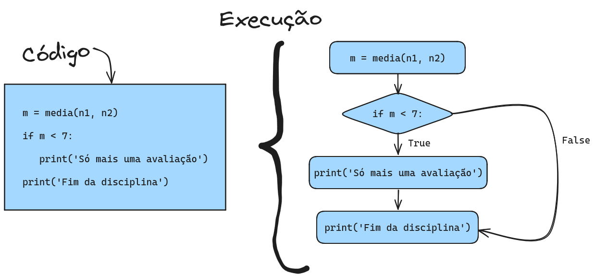

<!--
author:   Andrea Charão

email:    andrea@inf.ufsm.br

version:  0.0.1

language: PT-BR

narrator: Brazilian Portuguese Female

comment:  Material de apoio para a disciplina
          ELC106 - Algoritmo e Programação,
          da Universidade Federal de Santa Maria

translation: English  translations/English.md

link:     custom.css
          https://fonts.googleapis.com/css?family=Quattrocento%20Sans
-->
<!--
liascript-devserver --input README.md --port 3001 --live
link:     https://cdn.jsdelivr.net/gh/liascript/custom-style/custom.min.css
          https://cdn.jsdelivr.net/gh/andreainfufsm/elc106-2023a/classes/03/custom.css
          https://fonts.googleapis.com/css?family=Abril%20Fatface

-->

[](https://liascript.github.io/course/?https://raw.githubusercontent.com/AndreaInfUFSM/elc106-2024a/master/classes/04/README.md)

# Aula 04

- Requisito: exercícios da aula anterior.

- Inicie visualizando a seção de Revisão.

- Hoje: muita revisão, testes de conhecimento, execução passo-a-passo, mais sobre condicionais, exercícios


## Revisão

Principais assuntos da aula passada:

- Geração de números pseudoaleatórios
- Controle de execução com instruções `if`/`else` (condicionais)
- Variáveis contadoras


### Variáveis contadoras


- Pense que uma variável é como uma caixa etiquetada
- A "caixa" é um espaço na memória do computador
- A "etiqueta" é o nome da variável


??[](https://youtu.be/c5lLOHHg50A)

### Estruturas condicionais

1. São partes do código iniciadas por `if` + condição
2. Condições são expressões que resultam em `True` (verdadeiro) ou `False` (falso)
3. Blocos de comandos são executados ou não, dependendo da condição verificada




### Sintaxe: `if` e `if`/`else`

**ATENÇÃO**: bloco de comandos deve ser recuado à direita (*indent* obrigatório)

Estrutura `if` (se)

```python
if condição:
   primeiro comando do bloco
   segundo comando do bloco
   outros comandos do bloco
```

Estrutura `if`/`else` (se/senão)

```python
if condição:
   primeiro comando do bloco executado se condição verdadeira
   segundo comando do bloco executado se condição verdadeira
   outros comandos do bloco executado se condição verdadeira
else:
   primeiro comando do bloco executado se condição falsa
   segundo comando do bloco executado se condição falsa
   outros comandos do bloco executado se condição falsa
```

### Vídeo sobre expressões lógicas

*CS Discoveries: Boolean Expressions*

Ative as legendas automáticas em português!


> Expressões booleanas / lógicas: resultam `True` ou `False`

Link: https://www.youtube.com/watch?v=_j9nvYKaOVE

??[](https://www.youtube.com/watch?v=_j9nvYKaOVE)


### Execução linha por linha

Qual será a saída deste código? 

``` python
01: x = 3
02: def mystery(a, b):
03:   print(a, b)
04:   if a > b:
05:     c = a + 4
06:   else:
07:     c = -1
08:   return c
09: y = 4
10: z = 5
11: y = mystery(z, x)
12: print(x, y, z)
```

> Para determinar sua saída/resultado, precisamos analisá-lo linha por linha, acompanhar o valor das variáveis e "saltar" de uma linha para outra mais distante quando encontrarmos comandos que alteram a sequência de execução: definição de função, chamada de função, retorno de função, condicional.

Descrição da execução linha por linha:

- Linha 01: Variável `x` guarda o valor `3`
- Linha 02: Define a função `mystery`, guardando-a na memória. Esta função não será executada neste momento, mais sim quando for chamada em outro ponto do código. Portanto, a execução salta para linha seguinte à definição da função (linha 09)
- Linha 09: Variável `y` guarda o valor `4`
- Linha 10: Variável `z` guarda o valor `5`
- Linha 11: Chama a função `mystery` com as variáveis `z` e `x` nas posições de `a` e `b`, respectivamente. A execução salta para a linha 02, onde inicia a função
- Linha 02: Parâmetro/variável `a` recebe o valor `5` (que estava em `z`) e `b` recebe o valor `3` (que estava em `x`)
- Linha 03: Mostra na tela os valores de `a` e `b`: `5 3`
- Linha 04: Verifica se `a` é maior que `b`: verdadeiro! Então, a execução segue para a linha 05 e as linhas 06 e 07 não serão executadas (só seriam executadas se a condição fosse falsa)
- Linha 05: Variável `c` guarda o valor da expressão `a + 4`, que será igual a `9`. A execução segue após o bloco condicional, ou seja, vai para a linha 08
- Linha 08: Retorna o valor da variável `c` para a linha em que a função foi chamada, ou seja, linha 11.
- Linha 11: Variável `y` guarda o valor retornado pela função `mystery`, ou seja, o valor `9`.
- Linha 12: Mostra os valores de `x`, `y` e `z`, respectivamente: `3 9 5`


### Soluções dos exercícios

Instruções:

- Clique no link mais abaixo para ver a solução dos exercícios da aula anterior
- Copie o conteúdo para um novo arquivo no Repl.it
- Execute o programa no Repl.it

Soluções:

- [aula03\_solucoes.py](src/aula03_solucoes.py)


## Teste seu conhecimento

Duas atividades para você testar o que já sabe sobre o maravilhoso mundo dos algoritmos e programação em Python!

### Python em ação

> O que você já compreende?

Veja Python em ação no mundo profissional (código da biblioteca Pandas):

https://github.com/pandas-dev/pandas/blob/main/pandas/core/tools/numeric.py

Você consegue reconhecer: 

- [ ] definições de funções
- [ ] chamadas de funções
- [ ] parâmetros de funções
- [ ] variáveis
- [ ] estruturas condicionais
- [ ] comentários


### Desembaralhe o código

> **NO PAPEL**: Desembaralhe o código, ajuste a endentação e passe para o(a) colega corrigir

> **ATENÇÃO!** Algumas linhas de código não fazem parte da solução (são "distratores")

Requisitos:

- Complete a função chamada `temfebre` para retornar "sim' ou "não" após
  verificar se uma dada temperatura corporal representa febre (> 37.8)
- Gere 2 números fracionários aleatórios representando temperaturas entre 35 e 40, arredondando-os
  com 1 casa decimal e armazenando-os em variáveis
- Use a função `temfebre` com as temperaturas geradas
- Use a função `print` para compor a saída do programa
- Produza uma saída exatamente no formato a seguir, adaptado conforme os números gerados:

  - Temperatura: 39.8 Tem febre? sim
  - Temperatura: 36.9 Tem febre? não

``` 
01: t = temfebre(t1)
02: print('Temperatura:', t2, 'Tem febre?', temfebre(t2))
03: return "sim"
04: else:
05: t2 = round(uniform(35, 40), 1)
06: from random import uniform
07: print('Temperatura:', t1, 'Tem febre?', temfebre(t1))
08: t = t1 + t2
09: t1 = round(uniform(35, 40), 1)
10: if t > 37.8:
11: return "não"
12: def temfebre(t): 
13: print(t) 
```


### Quiz

Teste seu conhecimento junto com colegas!

> Estes testes não são corrigidos automaticamente. Você vai ajudar a construir o gabarito.


                 {{1}}
************************************************
Qual será a saída do código abaixo?

```python
def f(x):
  return x + 5

n = 5
n = n + 1
print(f(n))
```

- [(a)] (a) 5
- [(b)] (b) 6
- [(c)] (c) 11

************************************************


                 {{2}}
************************************************
Qual será a saída do código abaixo?

```python
n = 5 + 2**2
if n > 10:
  print('Condição verdadeira!')
else:
  print('Condição falsa!')
```

- [(a)] (a) `Condição verdadeira!`
- [(b)] (b) `Condição falsa!`

************************************************


                 {{3}}
************************************************

Qual será a saída do código abaixo?

```python
from math import sqrt
x = 10**2
if sqrt(x) > 9:
  print('Condição verdadeira!')
else:
  print('Condição falsa!')
```

- [(a)] (a) `Condição verdadeira!`
- [(b)] (b) `Condição falsa!`

************************************************


                 {{4}}
************************************************

Suponha que seu programa tenha uma variável `n` representando um número inteiro e uma função `numeropar(x)` que retorne `True` se for chamada com um argumento par e `False` se for chamada com um argumento ímpar. Qual dos códigos abaixo testa se `n` é par:


- [(a)] (a) `if n == True:`
- [(b)] (b) `if numeropar(n):`
- [(c)] (c) `if numeropar(x) == True:`

************************************************

                 {{5}}
************************************************

Suponha que seu programa tenha uma variável `cpf` representando um CPF e uma função `isValidCPF(cpf)` que retorne `True` se for chamada com CPF válido ou `False` se for chamada com um CPF inválido. 

Sabendo disso, observe os seguintes códigos:

1. `if isValidCPF(cpf) == True:`
2. `if isValidCPF(cpf):`

Os códigos 1 e 2 produzem o mesmo resultado?

- [(a)] (a) Sim
- [(b)] (b) Não


************************************************


                 {{6}}
************************************************

Quantas linhas de texto serão mostradas na tela quando o programa abaixo for executado?

Obs.: Aqui temos uma nova função...
<details>
  <summary>Clique para saber sobre ela</summary>
<ul>
<li>A função `len(c)` retorna o número de itens em um conjunto de dados (veremos isso mais adiante)</li>
<li>Textos em Python são conjuntos de caracteres (um tipo de dado)</li>
<li>`len('abracadabra')` retorna o valor `11`, que é a quantidade de caracteres do texto `'abracadabra'`</li>
</ul>
</details>

```python
tamanho = len('mensagem')
if tamanho > 10:
  print('Condicao verdadeira!')
print('Continuo executando')
print('Cheguei no final')
```


- [(a)] (a) 2 linhas
- [(b)] (b) 3 linhas

************************************************


                 {{7}}
************************************************

Qual será o resultado da execução do código abaixo?

```python
def func(x):
  return x * x

n = 5
if func(n) > 10:
  print(n)
else:
  print(25)
```

- [(a)] (a) 25
- [(b)] (b) 10
- [(c)] (c) 5

************************************************


                 {{8}}
************************************************

Por que o programa abaixo está errado?

```python
print(round(n, 2))
n = 3.1416
```

- [(a)] (a) Porque a função `round` foi usada antes de ser importada
- [(b)] (b) Porque a variável `n` foi usada antes de receber um valor


************************************************

                 {{9}}
************************************************

Considere os trechos de código abaixo:

(a)

```python
x = randint(1,10)
if < 5:
  print('Primeira metade')
```

(b)

```python
x = randint(1,10)
if x < 5:
  print('Primeira metade')
```

Qual código contém um erro?

- [(a)] (a)
- [(b)] (b)


************************************************


                 {{10}}
************************************************

Qual será o resultado da execução do código abaixo?

```python
def func(x):
  if x % 2 == 0:
    return -x
  else:
    return x

n = 4
if func(n) > 0 and func(n) < 10:
  print('Primeiro caso')
else:
  print('Outro caso')
```

- [(a)] (a) `Primeiro caso`
- [(b)] (b) `Outro caso`


************************************************


## Execução passo-a-passo

- Visualizar a execução passo-a-passo pode ser útil para:

  - entender um programa
  - depurar o programa: localizar e corrigir erros (bugs)

- Ferramentas: Python Tutor, Debug no Repl.it, etc.

### Python Tutor (1)
Um [exemplo](https://pythontutor.com/visualize.html#code=from%20random%20import%20randint%0A%0A%23%20neste%20ambiente,%20o%20n%C3%BAmero%20vai%20se%20repetir%0An%20%3D%20randint%281,6%29%0Aprint%28'Tirei',%20n%29%0Aif%20%28n%20%3D%3D%206%29%3A%0A%20%20%20%20print%28'Que%20sorte!'%29%0Aprint%28'Fim%20do%20programa'%29%20%20%20%20&cumulative=false&heapPrimitives=true&mode=edit&origin=opt-frontend.js&py=3&rawInputLstJSON=%5B%5D&textReferences=false) passo-a-passo com `if`:


<iframe width="1200" height="650" frameborder="0" src="https://pythontutor.com/visualize.html#code=from%20random%20import%20randint%0A%0A%23%20neste%20ambiente,%20o%20n%C3%BAmero%20vai%20se%20repetir%0An%20%3D%20randint%281,6%29%0Aprint%28'Tirei',%20n%29%0Aif%20%28n%20%3D%3D%206%29%3A%0A%20%20%20%20print%28'Que%20sorte!'%29%0Aprint%28'Fim%20do%20programa'%29%20%20%20%20&cumulative=false&heapPrimitives=true&mode=edit&origin=opt-frontend.js&py=3&rawInputLstJSON=%5B%5D&textReferences=false"> </iframe>


### Python Tutor (2)

Um [exemplo](https://pythontutor.com/visualize.html#code=from%20random%20import%20randint%0Acontador%20%3D%200%0A%0An%20%3D%20randint%281,6%29%0Aprint%28n%29%0Aif%20n%20%3D%3D%204%3A%0A%20%20%20%20contador%20%3D%20contador%20%2B%201%0A%20%20%20%20%0An%20%3D%20randint%281,6%29%0Aprint%28n%29%0Aif%20n%20%3D%3D%204%3A%0A%20%20%20%20contador%20%3D%20contador%20%2B%201%0A%20%20%20%20%0An%20%3D%20randint%281,6%29%0Aprint%28n%29%0Aif%20n%20%3D%3D%204%3A%0A%20%20%20%20contador%20%3D%20contador%20%2B%201%0A%20%20%20%20%0Aprint%28'Quantas%20vezes%20sorteamos%20o%20n%C3%BAmero%204%3F',%20contador%29&cumulative=false&heapPrimitives=true&mode=edit&origin=opt-frontend.js&py=3&rawInputLstJSON=%5B%5D&textReferences=false) passo-a-passo com `if` e variável contadora:

<iframe width="1200" height="650" frameborder="0" src="https://pythontutor.com/iframe-embed.html#code=from%20random%20import%20randint%0Acontador%20%3D%200%0A%0An%20%3D%20randint%281,6%29%0Aprint%28n%29%0Aif%20n%20%3D%3D%204%3A%0A%20%20%20%20contador%20%3D%20contador%20%2B%201%0A%20%20%20%20%0An%20%3D%20randint%281,6%29%0Aprint%28n%29%0Aif%20n%20%3D%3D%204%3A%0A%20%20%20%20contador%20%3D%20contador%20%2B%201%0A%20%20%20%20%0An%20%3D%20randint%281,6%29%0Aprint%28n%29%0Aif%20n%20%3D%3D%204%3A%0A%20%20%20%20contador%20%3D%20contador%20%2B%201%0A%20%20%20%20%0Aprint%28'Quantas%20vezes%20sorteamos%20o%20n%C3%BAmero%204%3F',%20contador%29&codeDivHeight=400&codeDivWidth=350&cumulative=false&curInstr=0&heapPrimitives=true&origin=opt-frontend.js&py=3&rawInputLstJSON=%5B%5D&textReferences=false"> </iframe>


## Mais sobre condicionais

O que fazer quando temos que testar muitas condições em um programa?


### Um caso com muitas condições

Por exemplo, vejamos esta tabela de classificação do IMC (Índice de Massa Corporal), obtida em: https://www.tuasaude.com/imc/


<!-- data-type="none" -->
| IMC (kg/m**2)   | Classificação   |
| :--------- | :------------  | 
| Menor que 18.5       | Magreza     |
| 18.5 a 24.9      | Peso normal      | 
| 25 a 29.9        | Sobrepeso          | 
| 30 a 34.9        | Obesidade grau I         | 
| 35 a 40       | Obesidade grau II | 
| Maior que 40       | Obesidade grau III | 

### Usando `if`s aninhados

- No exemplo do IMC, precisamos testar progressivamente várias condições
- Uma opção para isso é usar vários `if`/`else` aninhados (blocos recuados contendo mais `if`/`else`)


```python
def classifimc(p, h):
  imc = p/h**2
  if imc < 18.5:
    return "Magreza"
  else:
    if imc <= 24.9:
      return "Peso normal"
    else: 
      if imc <= 29.9:
        return "Sobrepeso"
      else:
        if imc <= 34.9:
          return "Obesidade grau I"
        else:
          if imc <= 40:
            return "Obesidade grau II"
          else:
            return "Obesidade grau III"


peso = 80
altura = 1.70
print(classifimc(peso,altura))
```


### Usando `elif`

- Muitos `if`s aninhados podem deixar um programa difícil de entender
- `elif` combina `else` com `if` em uma única linha de código


Reescrevendo o código anterior: 

```python
def classifimc(p, h):
  imc = p/h**2
  if imc < 18.5:
    return "Magreza"
  elif imc <= 24.9:
    return "Peso normal"
  elif imc <= 29.9:
    return "Sobrepeso"
  elif imc <= 34.9:
    return "Obesidade grau I"
  elif imc <= 40:
    return "Obesidade grau II"
  else:
    return "Obesidade grau III"

peso = 80
altura = 1.70
print(classifimc(peso,altura))
```

Quando um bloco aninhado só tem uma linha, podemos escrevê-lo de forma compactada:

```python
def classifimc(p, h):
  imc = p/h**2
  if imc < 18.5:    return "Magreza"
  elif imc <= 24.9: return "Peso normal"
  elif imc <= 29.9: return "Sobrepeso"
  elif imc <= 34.9: return "Obesidade grau I"
  elif imc <= 40:   return "Obesidade grau II"
  else:             return "Obesidade grau III"

peso = 80
altura = 1.70
print(classifimc(peso,altura))
```


### Operadores lógicos

- Servem para combinar duas ou mais condições
- Operadores: `and`, `or`, `not`
- Cada operando é uma condição que resulta `True` ou `False`

#### Exemplos

Considere `x = 4`:

<!-- data-type="none" -->
| Operador   | Significado    | Exemplo    | Resultado   |
| :--------- | :------------  | :--------- | :--------- |
| `and`       | "e" lógico    | `x > 2 and x < 10`     | `True`    |
| `or`      | "ou" lógico      | `x < 10 or x > 100`     | `False`     |
| `not`        | negação          | `not x < 0`      | `True` |

Teste no **interpretador**!

<iframe src="https://trinket.io/embed/python3/d52f952885?outputOnly=true&runOption=console&runMode=console" width="100%" height="300" frameborder="0" marginwidth="0" marginheight="0" allowfullscreen></iframe>


#### Tabelas-verdade

Tabela-verdade: combinações para `and` e `or`

<!-- data-type="none" -->
| a   | b    | a and b    | a or b   |
| :-- | :--  | :--------- | :--------- |
| `False`       | `False`    | `False`     | `False`     |
| `True`      | `False`     | `False`     | `True`     |
| `False`        | `True`       | `False`      | `True` |
| `True`        | `True`       | `True`      | `True` |

Tabela-verdade: combinações para `not`

<!-- data-type="none" -->
| a   | not a    | 
| :-- | :--  | 
| `False`       | `True`    | 
| `True`      | `False`     | 


### Jogo: Boolean Game

Pense rápido e resolva estes desafios com expressões booleanas!

https://booleangame.com/

Este jogo não usa Python, mas basta usar esta "tradução" dos operadores lógicos:

- `&&` significa `and`
- `||` significa `or`
- `!` significa `not`


## Exercícios


Para fazer os exercícios, você precisa de um IDE como o Repl.it.

Se você já tem alguma experiência com programação, você pode usar qualquer outro ambiente.


### Inicie o Repl.it


Acesse o Repl.it: https://replit.com


### Complete o código

- Baixe o arquivo [aula04\_exercicios.py](src/aula04_exercicios.py)

  - Este arquivo contém o enunciado dos exercícios e o início da definição de cada função
  

- Coloque este arquivo no Repl.it:
  
  - Você pode fazer upload do arquivo
  - Ou criar novo arquivo vazio e copiar-colar o conteúdo

- Siga as instruções no próprio código

  - Sua tarefa será completar o código nos pontos marcados com "COMPLETE-ME".

- Teste seu código

  - Você sempre deve **executar** seu código para verificar se está correto!

     - Opção 1: Use a aba "Console" no Repl.it e clique em Run ou Ctrl-Enter
     - Opção 2: Use a aba "Shell" no Repl.it e digite `python aula04_exercicios.py` (clicando Enter depois)

