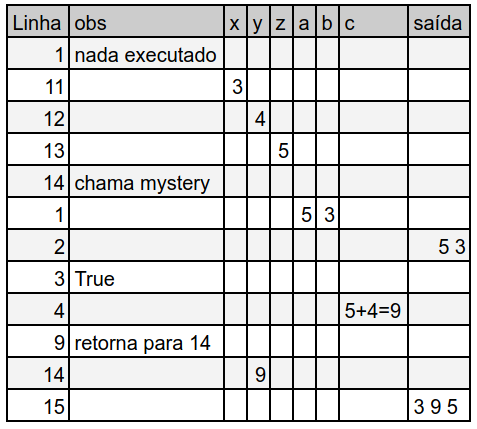

<!--
author:   Andrea Charão

email:    andrea@inf.ufsm.br

version:  0.0.1

language: PT-BR

narrator: Brazilian Portuguese Female

comment:  Material de apoio para a disciplina
          ELC106 - Algoritmo e Programação,
          da Universidade Federal de Santa Maria

translation: English  translations/English.md

link:     custom.css
          https://fonts.googleapis.com/css?family=Quattrocento%20Sans

script:   https://cdn.jsdelivr.net/pyodide/v0.24.0/full/pyodide.js


@Pyodide.exec: @Pyodide.exec_(@uid,```@0```)

@Pyodide.exec_
<script>
async function run(code, force=false) {
    if (!window.pyodide_running || force) {
        window.pyodide_running = true
    
        const plot = document.getElementById('target_@0')
        plot.innerHTML = ""
        document.pyodideMplTarget = plot

        if (!window.pyodide) {
            try {
                window.pyodide = await loadPyodide({fullStdLib: false})
                window.pyodide_modules = []
                window.pyodide_running = true
            } catch(e) {
                send.lia(e.message, false)
                send.lia("LIA: stop")
            }
        }

        try {
            window.pyodide.setStdout((text) => console.log(text))
            window.pyodide.setStderr((text) => console.err(text))

            window.pyodide.setStdin({stdin: () => {
            return prompt("stdin")
            }})
        
            const rslt = await window.pyodide.runPython(code)
            
            if (rslt !== undefined) {
                send.lia(rslt)
            } else {
                send.lia("")
            }
        } catch(e) {
            let module = e.message.match(/ModuleNotFoundError: The module '([^']+)/i)

            window.console.warn("Pyodide", e.message)
        
            if (!module) {
                send.lia(e.message, false)
            
            } else {
                if (module.length > 1) {
                    module = module[1]

                    if (window.pyodide_modules.includes(module)) {
                        console.warn(e.message)
                        send.lia(e.message, false)
                    } else {
                        send.lia("downloading module => " + module)
                        window.pyodide_modules.push(module)
                        await window.pyodide.loadPackage(module)
                        await run(code, true)
                    }
                }
            }
        }
        send.lia("LIA: stop")
        window.pyodide_running = false
    } else {
        setTimeout(() => { run(code) }, 1000)
    }
}

setTimeout(() => { run(`@1`) }, 500)

"calculating, please wait ..."

</script>

<div id="target_@0"></div>
@end


@Pyodide.eval: @Pyodide.eval_(@uid)

@Pyodide.eval_
<script>
async function run(code) {

    const plot = document.getElementById('target_@0')
    plot.innerHTML = ""
    document.pyodideMplTarget = plot

    if (!window.pyodide) {
        try {
            window.pyodide = await loadPyodide({fullStdLib: false})
            window.pyodide_modules = []
            window.pyodide_running = true
        } catch(e) {
            console.error(e.message)
            send.lia("LIA: stop")
        }
    }

    try {
        window.pyodide.setStdout({ write: (buffer) => {
            const decoder = new TextDecoder()
            const string = decoder.decode(buffer)
            console.stream(string)
            return buffer.length
        }})

        window.pyodide.setStderr({ write: (buffer) => {
            const decoder = new TextDecoder()
            const string = decoder.decode(buffer)
            console.err(string)
            return buffer.length
        }})

        window.pyodide.setStdin({stdin: () => {
          return prompt("stdin")
        }}) 
       
        const rslt = await window.pyodide.runPython(code)

        if (typeof rslt === 'string') {
            send.lia(rslt)
        }
    } catch(e) {
        let module = e.message.match(/ModuleNotFoundError: The module '([^']+)/i)

        window.console.warn("Pyodide", e.message)
    
        if (!module) {
            const err = e.message.match(/File "<exec>", line (\d+).*\n((.*\n){1,3})/i)

            if (err!== null && err.length >= 3) {
                send.lia( e.message,
                  [[{ row : parseInt(err[1]) - 1,
                      column : 1,
                      text : err[2],
                      type : "error"
                  }]],
                  false)
            } else {
                console.error(e.message)
            }
        } else {
            if (module.length > 1) {
                module = module[1]

                if (window.pyodide_modules.includes(module)) {
                    console.error(e.message)
                } else {
                    console.debug("downloading module =>", module)
                    window.pyodide_modules.push(module)
                    await window.pyodide.loadPackage(module)
                    await run(code)
                }
            }
        }
    }
    send.lia("LIA: stop")
    window.pyodide_running = false
}

if (window.pyodide_running) {
  setTimeout(() => {
    console.warn("Another process is running, wait until finished")
  }, 500)
  "LIA: stop"
} else {
  window.pyodide_running = true

  setTimeout(() => {
    run(`@input`)
  }, 500)

  "LIA: wait"
}
</script>

<div id="target_@0"></div>
@end

-->


<!--
liascript-devserver --input README.md --port 3001 --live
link:     https://cdn.jsdelivr.net/gh/liascript/custom-style/custom.min.css
          https://cdn.jsdelivr.net/gh/andreainfufsm/elc106-2023a/classes/10/custom.css

-->

[](https://liascript.github.io/course/?https://raw.githubusercontent.com/AndreaInfUFSM/elc106-2024a/master/classes/10/README.md)

# Aula 10

- Revisão (pré-aula)
- Novidades: repetição com `for` e mais exercícios com listas


## Revisão (pré-aula)


Você entendeu?

- Execução passo-a-passo (com e sem computador)
- Listas (tipo de dado composto)
- Repetição com `while`


### Execução passo-a-passo

> Execução passo-a-passo: você é o computador!

- Clique no botão abaixo do código, à esquerda, para executá-lo.
- Depois de executar o código, siga adiante para ver uma tabela que ajuda na execução passo-a-passo.


```python
def mystery(a, b):
  print(a, b)
  if a > b:
    c = a + 4
  elif b > a:
    c = b - 2
  else:
    c = -1
  return c

x = 3
y = 4
z = 5
y = mystery(z, x)
print(x, y, z)
```
@Pyodide.eval

#### No papel!

Passo-a-passo "no papel": trace table / teste de mesa



```python
def mystery(a, b):
  print(a, b)
  if a > b:
    c = a + 4
  elif b > a:
    c = b - 2
  else:
    c = -1
  return c

x = 3
y = 4
z = 5
y = mystery(z, x)
print(x, y, z)
```
@Pyodide.eval

#### Outro problema

Em uma tabela em papel, mostre passo-a-passo qual será a saída exibida por este código:

```python
1: def xpto(n1, n2):
2:   while n1 != n2:
3:     if (n1 < n2):
4:       n2 = n2 - n1
5:     else:
6:       n1 = n1 - n2
7:   return n1
8: print(xpto(20,5))
```

Fonte: Questão adaptada de prova de concurso elaborada pela FGV 

### Listas

- Recurso da linguagem para representar conjuntos de dados
- Coleção de valores acessíveis por um único nome de variável

  Exemplos:

  ```python
  a = 10
  numeros = [a, a+1, a+2]
  print('Conteúdo da lista é:', numeros)
  print('Tamanho da lista é:', len(numeros))

  ```
@Pyodide.eval


#### Acesso a elementos

- Podemos acessar cada elemento da lista usando índices 
- Python numera (indexa) os elementos a partir de zero

```python
verbos = ['correr','saltar','repetir']
print(verbos[0])
```
@Pyodide.eval

<!--
style="
  display: block;
  margin-left: auto;
  margin-right: auto;
  max-width: 80%;
  stroke: green;" -->
``` ascii
 verbos = ['correr','saltar','repetir']

          +----------+----------+-----------+
 verbos = | 'correr' | 'saltar' | 'repetir' |
          +----------+----------+-----------+
               0          1           2
```

#### Funções com listas


Algumas funções com listas: https://docs.python.org/pt-br/3/tutorial/datastructures.html

Por exemplo, dada uma lista `xs`:

- `len(xs)`: retorna tamanho (quantidade de itens) da lista
- `xs.count(10)`: conta quantos elementos são iguais ao valor `10` na lista
- `xs.count(val)`: conta quantos elementos são iguais ao valor da variável `val`
- `xs.append(10)`: adiciona valor `10` ao fim da lista
- `xs.insert(i, 10)`: insere valor `10` na posição `i` da lista
- `xs.pop()`: remove último item da lista e o retorna
- `xs.pop(0)`: remove item na posição `0` da lista e o retorna
- `xs.remove(val)`: remove valor da variável `val` da lista, se existir
- `xs.clear()`: remove todos os elementos da lista


### Repetição com `while`

- É uma poderosa estrutura de controle da execução
- Executa um bloco de comandos repetidamente enquanto uma condição for verdadeira


#### Número indefinido de repetições

Podemos usar `while` em repetições que vão executar um número indefinido de vezes

```python
while True:
  senha = input('Digite a senha: ')
  if senha == "abracadabra":
    break
  else:
    print('Senha incorreta. Tente novamente')
```


```python
from random import randint
while True:
  n = randint(1,10)
  print(n)
  if n == 6:
    break
```
@Pyodide.eval


#### Número definido de repetições

Também podemos usar `while` em repetições com um número definido de vezes (ou seja, existe um máximo)

Chamar cada um dos pets :-)

```python
pets = ['Max', 'Chloe', 'Mel', 'Buddy']
i = 0
while i < len(pets):
  print('Where are you', pets[i], '?')
  i = i + 1
```
@Pyodide.eval


Calcular o fatorial de um número:

```python
def fat(n):
  """ Fatorial de um número positivo, maior ou igual a zero """
  fat = 1
  while n > 0:
    fat = fat * n
    n = n - 1
  return fat  

print(fat(5)) 
print(5*4*3*2*1) 
```
@Pyodide.eval


Verificar se uma lista de dígitos pode representar um número binário: 

```python
def isbin(digits):
  i = 0
  while i < len(digits):
    if digits[i] == 0 or digits[i] == 1:
      i = i + 1
    else:
      return False
  return True and len(digits) > 0

list1 = [0,1,1,0]
list2 = [0,1,2,3]
print(isbin(list1))
print(isbin(list2))
```
@Pyodide.eval


## Mais repetição e listas


Aqui temos uma **novidade**: comando `for`

> Qual será a saída?


Usando `for`:

```python
friends = ['Ana', 'Barbara', 'Clara']
for x in friends:
  print('Hello', x)
```
@Pyodide.eval

Usando `while`:

```python
friends = ['Ana', 'Barbara', 'Clara']
i = 0
while i < len(friends):
  print('Hello', friends[i])
  i = i + 1
```
@Pyodide.eval


### Usando `for`

> Use `for` para executar um bloco de comandos para cada elemento de uma sequência.

> Não se preocupe com contador / índice: `for` cuida disso para você! 

Forma geral:

```python
for variável in coleção:
  comando1
  ...
  comandon
```

Observações:

- Também chamado de laço/loop do tipo `for`
- Bloco de comandos recuado à direita (indent) 
- Variável assume um valor a cada iteração do laço
- Execução pode ser interrompida com comando `break`
- Execução continua em sequência depois do bloco


### Passo-a-passo


Execute este programa passo-a-passo no [Python Tutor](https://pythontutor.com/visualize.html#code=friends%20%3D%20%5B'Ana',%20'Barbara',%20'Clara'%5D%0Afor%20x%20in%20friends%3A%0A%20%20print%28'Hello',%20x%29%0Aprint%28'Fim'%29%20%20&cumulative=false&curInstr=0&heapPrimitives=nevernest&mode=display&origin=opt-frontend.js&py=3&rawInputLstJSON=%5B%5D&textReferences=false):


<iframe width="800" height="500" frameborder="0" src="https://pythontutor.com/iframe-embed.html#code=friends%20%3D%20%5B'Ana',%20'Barbara',%20'Clara'%5D%0Afor%20x%20in%20friends%3A%0A%20%20print%28'Hello',%20x%29%0Aprint%28'Fim'%29%20%20&codeDivHeight=400&codeDivWidth=350&cumulative=false&curInstr=0&heapPrimitives=nevernest&origin=opt-frontend.js&py=3&rawInputLstJSON=%5B%5D&textReferences=false"> </iframe>


### Função `range` (sequências)

> E se a repetição precisar de uma sequência de números?

Com `while`:

```python
contador = 1
while contador < 10:
  print(contador)
  contador = contador + 1
print('Fim')
```
@Pyodide.eval


Com `for` e lista constante (não faça isso!):

```python
for contador in [1,2,3,4,5,6,7,8,9]:
  print(contador)
print('Fim')
```
@Pyodide.eval

Com `for` e `range` (bem melhor!):

```python
for contador in range(1,10):
  print(contador)
print('Fim')
```
@Pyodide.eval


### Mais sobre `range`

- Retorna uma sequência de números **até um limite** (não incluído - intervalo aberto)
- Por padrão (default), sequência inicia em 0 (start=0) e é icrementada de 1 (step=1)
- Parâmetros opcionais permitem sequências variadas

Formas gerais:

```python
range(stop)
range(start, stop)
range(start, stop, step)
```

| Parâmetro   | Descrição  |
| :--------- | :--------- |
| `start`     | (Opcional) Valor inicial da sequência (default = 0)    |
| `stop`     | (Obrigatório) Valor de parada da sequência (não incluúdo)  |
| `step`     | (Opcional) Valor de incremento da sequência, pode ser negativo (default = 1)  |

### Exemplos com `range`

- O resultado de `range` pode ser convertido para lista com a função `list`
- Quando usamos `range` com `for` não precisamos converter para lista


```python
xs = list(range(5))
print(xs)
xs = list(range(10,20,2))
print(xs)
xs = list(range(10, 5, -1))
print(xs)
xs = list(range(10, 5))
print(xs)
```
@Pyodide.eval


#### Com variáveis


```python
from random import randint
step = randint(1,2)
print('Step:', step)
xs = list(range(1,10,step))
print(xs)
```
@Pyodide.eval

## Exemplos com laços/loops `for`


### Gerando vários números

O código abaixo gera quantos números aleatórios?

Com `for`

```python
from random import randint
for seq in range(5):
  n = randint(1,20)
  print(n)
print('Fim da geração')
```
@Pyodide.eval

Com `while`

```python
from random import randint
seq = 0
while seq < 5:
  n = randint(1,20)
  print(n)
  seq = seq + 1
print('Fim da geração')
```
@Pyodide.eval


### Contagem regressiva


O código abaixo mostra na tela uma contagem regressiva

Com `for`

```python
for num in range(10,0,-1):
  print(num)
print('Boom!')
```
@Pyodide.eval


Com `while`

```python
num = 10
while num > 0:
  print(num)
  num = num - 1
print('Boom!')
```
@Pyodide.eval


### Tabela de multiplicação

O código abaixo mostra a "tabuada" do 3

Com `for`

```python
n = 3
for mult in range(11):
  print(n, 'x', mult, '=', n*mult)
```
@Pyodide.eval

Com `while`


```python
mult = 0
n = 3
while mult <= 10:
  print(n, 'x', mult, '=', n*mult)
  mult = mult + 1
```
@Pyodide.eval


### Laço com bloco condicional

Sempre podemos usar  `if` dentro dos laços

Com `for`

```python
from random import randint
for contador in range(5): # contador não é usado
  n = randint(1, 6)
  print('Sorteamos o número', n)
  if n == 6:
    print('Oba, tiramos o maior número!')
```
@Pyodide.eval

Com `while`

```python
from random import randint
contador = 0
while contador < 5:
  n = randint(1, 6)
  print('Sorteamos o número', n)
  if n == 6:
    print('Oba, tiramos o maior número!')
  contador = contador + 1
```
@Pyodide.eval


### Laço não executado

Se usarmos `for` com uma coleção vazia, o bloco de comandos não é executado.


```python
for i in range(1,10,-1):
  print('Não vou ser executado')
print('Fim do programa')  
```
@Pyodide.eval


### Somatório de valores


Com `for`: só precisamos da variável acumuladora da soma

```python
from random import randint, seed
seed(1)
soma = 0
for i in range(10):
  n = randint(1, 6)
  print('n =', n)
  soma = soma + n
print('Somatório:', soma)
```
@Pyodide.eval

Com `while`: precisamos de uma variável contadora para o laço e uma acumuladora para a soma


```python
from random import randint, seed
seed(1)
i = 1
soma = 0
while i <= 10:
  n = randint(1, 6)
  print('n =', n)
  soma = soma + n
  i = i + 1
print('Somatório:', soma)
```
@Pyodide.eval


### Triângulo

Concatenando strings com `+`

 <details>
  <summary>Clique aqui para ver outra forma de fazer isso</summary>
  <p>Ao contrário da maioria das linguagens, Python permite replicar strings com o operador '\*'. Por exemplo: 3*'z' resulta em 'zzz'. </p>
</details> 


```python
def replica(c, n):
  s = ''
  for i in range(n):
    s += c
  return s

for i in range(1,11):  
  print(replica('*',i))
  
```
@Pyodide.eval


Execute este programa passo-a-passo no [Python Tutor](https://pythontutor.com/visualize.html#code=def%20replica%28c,%20n%29%3A%0A%20%20s%20%3D%20''%0A%20%20for%20i%20in%20range%28n%29%3A%0A%20%20%20%20s%20%2B%3D%20c%0A%20%20return%20s%0A%0Afor%20i%20in%20range%281,5%29%3A%20%20%0A%20%20print%28replica%28'*',i%29%29&cumulative=false&curInstr=50&heapPrimitives=nevernest&mode=display&origin=opt-frontend.js&py=3&rawInputLstJSON=%5B%5D&textReferences=false):


<iframe width="800" height="500" frameborder="0" src="https://pythontutor.com/iframe-embed.html#code=def%20replica%28c,%20n%29%3A%0A%20%20s%20%3D%20''%0A%20%20for%20i%20in%20range%28n%29%3A%0A%20%20%20%20s%20%2B%3D%20c%0A%20%20return%20s%0A%0Afor%20i%20in%20range%281,5%29%3A%20%20%0A%20%20print%28replica%28'*',i%29%29&codeDivHeight=400&codeDivWidth=350&cumulative=false&curInstr=50&heapPrimitives=nevernest&origin=opt-frontend.js&py=3&rawInputLstJSON=%5B%5D&textReferences=false"> </iframe>


## Exercícios 

### Exercício 1

Escreva um programa que gere e mostre 5  números pseudoaleatórios representando anos no período entre 2010 e 2020 (inclusive).  No final, o programa deve mostrar quantos números gerados são maiores que 2015. Resolva este exercício primeiro usando `while`, depois usando `for`.

Exemplo de saída:

```
2020
2012
2015
2020
2016
Maiores que 2015: 3
```

### Exercício 2

(Adaptado de: https://programming-23.mooc.fi/part-2)

Usando `while`, escreva um programa que use a função `input` repetidamente para entrada (leitura) de um número inteiro. Se o número for negativo, o programa deve mostrar a mensagem "Número inválido". Se o número for maior do que zero, o programa deve mostrar a raiz quadrada do número. Em qualquer desses casos, o programa deve continuar solicitando a digitação do próximo número. Se o número for igual a zero, o programa deve mostrar uma mensagem e sair do laço.


Dica: use a função `int(...)` para converter para inteiro a string lida pela função `input`

Exemplo de execução:

```
Digite um número: 9
3.0
Digite um número: 4
2.0
Digite um número: 6
2.449489742783178
Digite um número: -2
Número inválido
Digite um número: 0
Terminando...
```


### Exercício 3


Fonte: https://programming-23.mooc.fi/part-2

Deseja-se mostrar uma contagem regressiva como no exemplo abaixo:

```
Countdown!
5
4
3
2
1
Now!
```

O código abaixo tenta fazer isso, mas tem  um erro. Corrija-o para obter a saída desejada.

``` python
number = 5
print("Countdown!")
while True:
  print(number)
  number = number - 1
  if number > 0:
    break
print("Now!")
```
@Pyodide.eval


### Exercício 4


Deseja-se completar um programa que gera números pseudoaleatórios entre 20 e 99 e os mostre escritos por extenso. Para isso, você deve baixar o arquivo [exercicio\_por\_extenso.py](src/exercicio_por_extenso.py) e completar as funções no arquivo:

- dezena\_por\_extenso: recebe um número de 2 a 9 e retorna "vinte" a "noventa"
- unidade\_por\_extenso: recebe um número de 0 e 9 e retorna a unidade por extenso

O restante do programa deve ficar inalterado. Ao final do programa, há 2 exemplos com lógica semelhante que podem servir de referência.

Exemplo de saída do programa:

```
sessenta e quatro
oitenta e três
vinte e um
noventa
vinte e oito
sessenta e nove
setenta e seis
setenta e oito
setenta e quatro
trinta e oito
```

### Exercício 5


Um sistema de automação residencial possui sensores de temperatura
que, periodicamente, produzem uma lista de valores representando
um conjunto de temperaturas medidas.
De vez em quando, alguns sensores falham e retornam medidas absurdas,
incompatíveis com a localidade e a estação do ano.
Sua tarefa é criar uma função que receba uma lista e 2 números
representando limiares de temperatura, e verifique se todos os elementos
da lista estão dentro dos limiares. A função deverá retornar `True` se todos
os elementos estiverem dentro dos limiares, ou `False` em caso contrário. Resolva este exercício primeiro usando `while`, depois usando `for`.

Dica: um laço pode ser interrompido com `return`

Exemplo de uso:

```
temperaturas = [32,31,22,33,34]
temperaturas_validas(temperaturas, 0, 40)
True
temperaturas = [32,31,22,-99,33,34]
temperaturas_validas(temperaturas, 0, 40)
False
```


### Exercício 6


Escreva uma função chamada `countchars`, que receba uma lista de strings e
retorne a quantidade total de caracteres na lista.
Você deve usar repetição com `for` neste exercício.

Exemplo de uso:

```
>>> countchars(['Era uma vez', 'Há muitos anos atrás'])
31
```

```python
def countchars(list):
  #COMPLETE-ME
 

print(countchars(['Era uma vez', 'Há muitos anos atrás']))

```

### Exercício 7

Usando `while` ou `for`, escreva uma função que receba um número N
inteiro e positivo e
que retorne o resultado S da seguinte soma:

S = 1 + 1/2 + 1/3 + 1/4 + ... + 1/N

Exemplo de uso:

```
>>> serie(8)
2.7178571428571425
```


``` python
def serie(N):
  #COMPLETE-ME


print(serie(8))
```